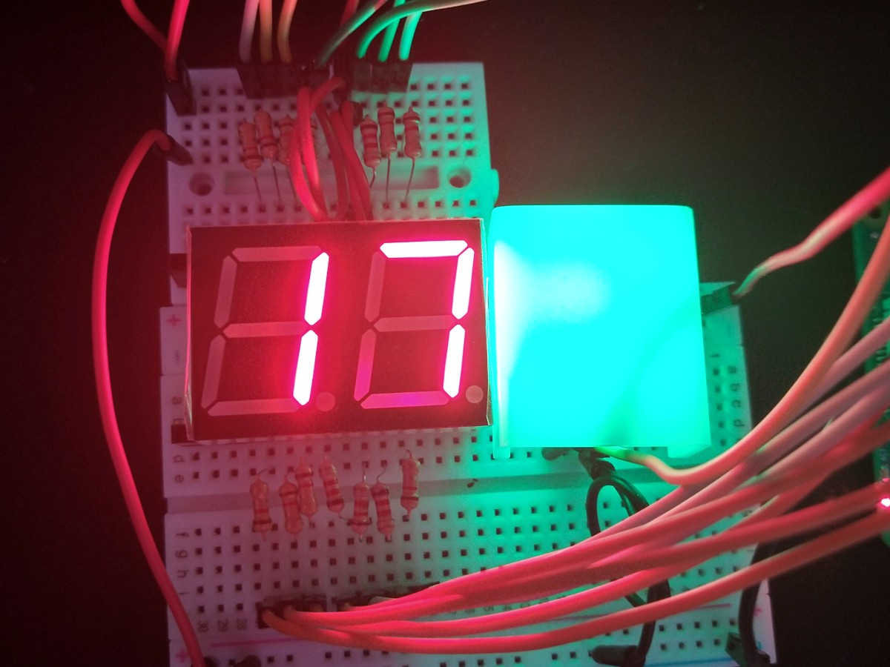
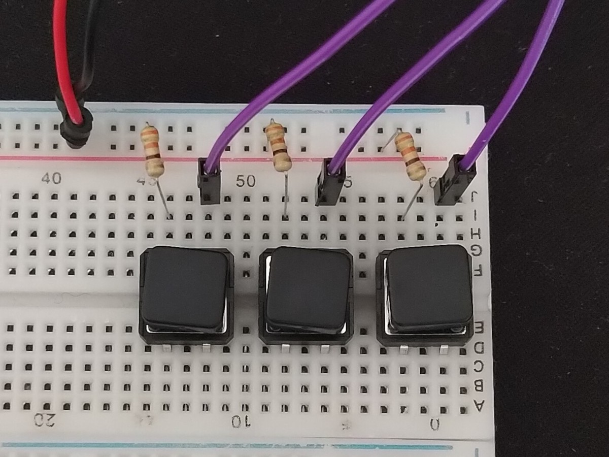

# PROJNAME

PROJNAME is a system helping to enforce occupancy limits in public spaces by counting people coming in and out.
It comprises:
* a central server for tracking devices,
* counter devices with ultrasonic and IR sensors,
* displays with a warning sign for visitors,
* control panels for security.

## Display

Display show the number of people currently in the space. When treshold is reached, warning light turns red and the display is blinking.

    
    

## Control panel

Control panel lets staff to quickly adjust recorded occupancy by:
* adding to counter,
* resetting counter value,
* subtracting to counter.

    

## Development

Pins in use:
* GPIO 18: display LED
* GPIO 20, 21, 26, 13, 6, 16, 19: rightmost counter display
* GPIO 1, 12, 5, 0, 11, 8, 7: leftmost counter display
* GPIO 15, 23, 25: control buttons
* GPIO 17: beam ir sensor
