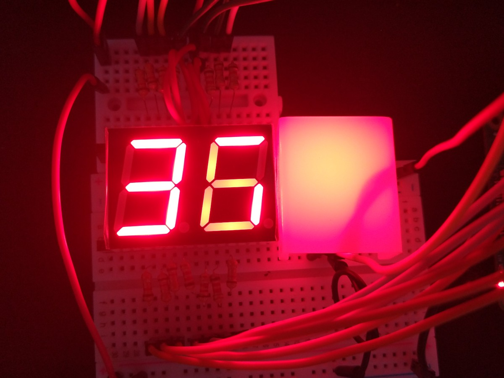

# People counter

People counter is a system helping to enforce occupancy limits in public spaces by counting people coming in and out.
It comprises:
* a central server for tracking devices,
* counter devices with ultrasonic and IR sensors,
* displays with a warning sign for visitors,
* control panels for security.
* a web app for controling a device remotely

See demo: https://youtu.be/eT9w5s_Paic

## Hardware

### Ultrasound and beam sensors

A pair of HC-SR04 ultrasound sensors detects when someone enter or exit room.
It sends events to main server thus can operate as standalone device based on Raspberry PI.

Beside power and ground pins, the sensors require 4 GPIO pins (each sensor has TRIGGER and ECHO pins).

    

    

A single beam interruption sensor detects an event of entering or exiting the room, but doesn't distinguish between the two types.
It relies on the pair of ultrasound sensors to decide wheter an exit or an enter event occured.

The beam sensor requires a power pin, a ground pin and a GPIO pin.

### Display

Display shows the number of people who entered the space. When treshold is reached, warning light turns red and the display is blinking.

    
    

    

### REST API Server

A REST API Server that allows us to increase, decrease or reset the number of people in the specified room was created. The server was written in Kotlin and deployed on a production server - we managed to make it public. The API consists of 4 endpoints:

* https://bhl-counter.herokuapp.com/exit to dispatch an exit event
* https://bhl-counter.herokuapp.com/enter to dispatch an enter event
* https://bhl-counter.herokuapp.com/reset to reset the number of people in the specified room
* https://bhl-counter.herokuapp.com/stats/id to get the number of people in room `id`

### Control panel

Control panel lets staff quickly adjust recorded occupancy by:
* adding to counter,
* resetting counter value,
* subtracting to counter.

    

    

### Web app

The web app displays the current number of people in a specified room. It allows for remote control over the people count in a room by connecting to the REST API Server.

    

## Development

Pins in use:
* GPIO 18: display LED
* GPIO 20, 21, 26, 13, 6, 16, 19: rightmost counter display
* GPIO 1, 12, 5, 0, 11, 8, 7: leftmost counter display
* GPIO 15, 23, 25: control buttons
* GPIO 17: beam ir sensor
